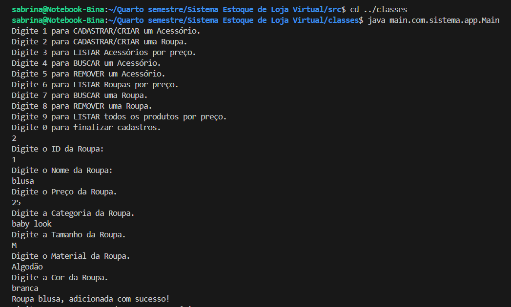
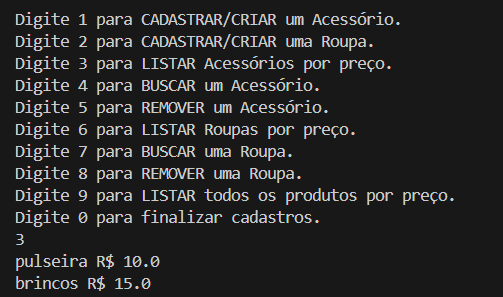
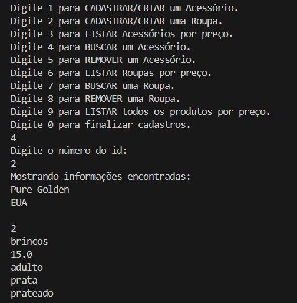
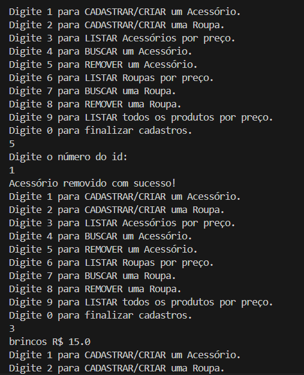
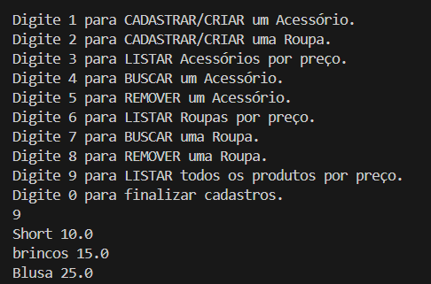

## LP II Projeto da 3ª unidade requisitado pelo Prof. Dr. Alan Santana

### Aluna: Sabrina da Silva Barbosa

## Como compilar

* Crie uma pasta com nome "classes"
* No terminal digite `cd src` para entrar na pasta "src":
* Em seguida, para gerar os arquivos .class, digite: `javac -d ../classes main/com/sistema/app/Main.java main/com/sistema/annotation/Etiqueta.java main/com/sistema/arvore/* main/com/sistema/dominio/* main/com/sistema/excecao/NegocioException.java main/com/sistema/ordenacao/MergeSort.java main/com/sistema/repositorio/*`
* Ainda no terminal, digite `cd ../classes` para sair da pasta "src" e entrar na pasta "classes"

## Como executar

* No terminal, digite `java main.com.sistema.app.Main`

## Exemplos de saída

* Cadastro de objeto

* Listar acessórios ordenados por preço

* Buscar acessório com leitura da annotation

* Remover acessório

* Listando todos os produtos ordenado por preço

## Observações

* A exibição das informações foram atualizadas para melhorar a leitura das mesmas pelo usuário. Nesse sentido, ao realizar o teste algumas saídas estarão relativamente diferentes das saídas dos exemplos.

## Descrição do trabalho

Desenvolva uma aplicação tema livre (ex.: produtos, alunos, agenda) que integre:

Estrutura de dados de árvore (ABB ou AVL).\
Algoritmo de ordenação (MergeSort ou HeapSort).\
POO avançada: interface(s), herança + polimorfismo, classe genérica, tratamento de exceções (inclui exceção de negócio).\
Annotation personalizada lida em tempo de execução (Reflection).\
Coleções genéricas (ArrayList / HashMap) quando fizer sentido.

Requisitos obrigatórios

Domínio com classe base + 2 subclasses (polimorfismo ativo).\
Interfaces (ex.: Repositorio<T>, Ordenacao<T>, Arvore<K,V>).\
Classe genérica (ex.: RepositorioHash<T> com Function<T,String> para ID).\
Exceções: NegocioException (regra de negócio) + try/catch no Main com mensagens claras.\
Annotation @InfoAutor (nome, data) aplicada em ≥2 classes; ler via reflexão e imprimir.\
Árvore (ABB/AVL): inserir, buscar, travessia em-ordem (retornar valores ordenados pela chave).\
Ordenação (Merge/Heap): ordenar lista por Comparator.\
Demonstração no Main: adicionar, listar, buscar, remover, imprimir em ordem (árvore) e ordenado (algoritmo).

Entregáveis

Código-fonte em packages (+ README com como compilar/rodar).\
Saída de console mostrando CRUD + árvore + ordenação + leitura de anotação.
